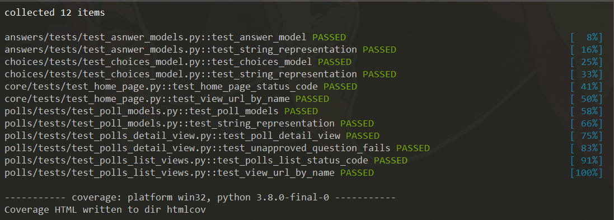

## Awesome Poll app

[](https://travis-ci.org/wandersonsc/awesome-poll) [](https://codecov.io/gh/wandersonsc/awesome-poll) [](https://www.codacy.com/manual/wandersonsc/awesome-poll?utm_source=github.com&utm_medium=referral&utm_content=wandersonsc/awesome-poll&utm_campaign=Badge_Grade)

### Poll site using best practices for Test Driven Development (TDD) & Pytest

## Technology Stack

- Python
- Travis
- Pytest

## Contributing

Fell free to give advice, code reviews or any other ideas

## Get the code and start the server.

1. Get the code:

```
git clone https://github.com/wandersonsc/awesome-poll
```

2. Create a virtualenv:

```sh
python3 -m venv virtualenv
```

3. Run it! Assuming you have Python setup, run the following commands:

```sh
pip3 install -r requirements.txt
python3 manage.py makemigrations
python3 manage.py migrate
python3 manage.py createsuperuser
python3 manage.py runserver

```

## Testing

To run the tests, check your test coverage, and generate a simplified coverage report & flake8:

```sh
pytest or pytest & flake8

```


